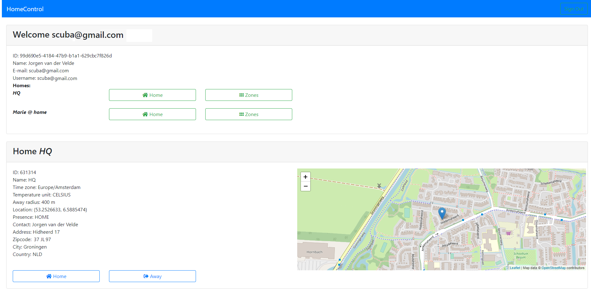
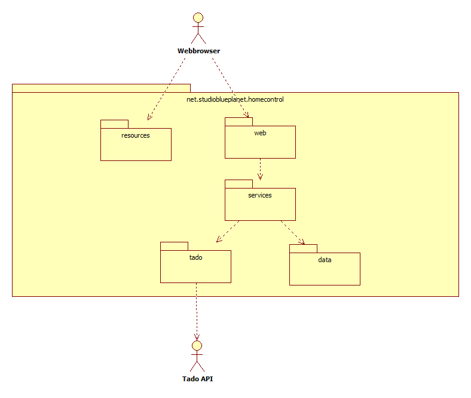

# Home Control

## Introduction
### Goal
This is a experimental project regarding usage of the Tado Home Control (zone heating). 
The goal is to provide a basis to build your own website for conrol of your Tado zone
heating, using the Tado API. The focus is to create a Tado REST API client.



### What it is
The project is presents a Bootstrap web page allowing you to see your home and 
control it. It offers not all the features the Tado apps offer, since it 
is not meant as replacement.

A feature it offers that is not offered by the Tado Apps is to see multiple
homes (though Tado is working on that): You can allow your home to be seen
and controlled by a friend. Currently this can be done by adding following line
to a file friendAccounts.json:

```
[{"account":"[username]","friendAccount":"[friend username]","creationDate":"Feb 24, 2021 10:17:02 AM"}]
```
Your friend has to log in once. The token of each logged in user is refreshed by the
application and used to access friend homes.

## Architecture
The project is setup as a Springboot web application offering a web site and a 
corresponding API. Underwater the project offers a REST client to the Tado API.



The architecture is a simple three-tier server application.

* **resources** Contains the webpage, based on Thymeleaf (in directory templates)
* **web** The application API (controller)
* **services** The 'business layer'
* **tado** The client for the Tado APIs
* **data** Persistency layer


## Prerequiste
An account is required at tado.nl.

## Usage
Use http://localhost:8080/ for an example of a website based on thymeleaf templates.
Use your Tado credentials to log in. Authentication takes place against the OAuth
authentication server of Tado.

## Integration testing
Adapt the file /src/test/resources/application.properties to enable integration
testing with Tado. The test requires your account credentials, home ID and zone IDs.
The interation test itself are in /src/test/java/net/studioblueplanet/homecontrol/tado/TadoIntegrationTest.java.
You can put your own version of application.properties in the root directory of the project
to prevent your credentials to accidentally end up in the git repo. This version overrules the version
in /src/test/resources.
